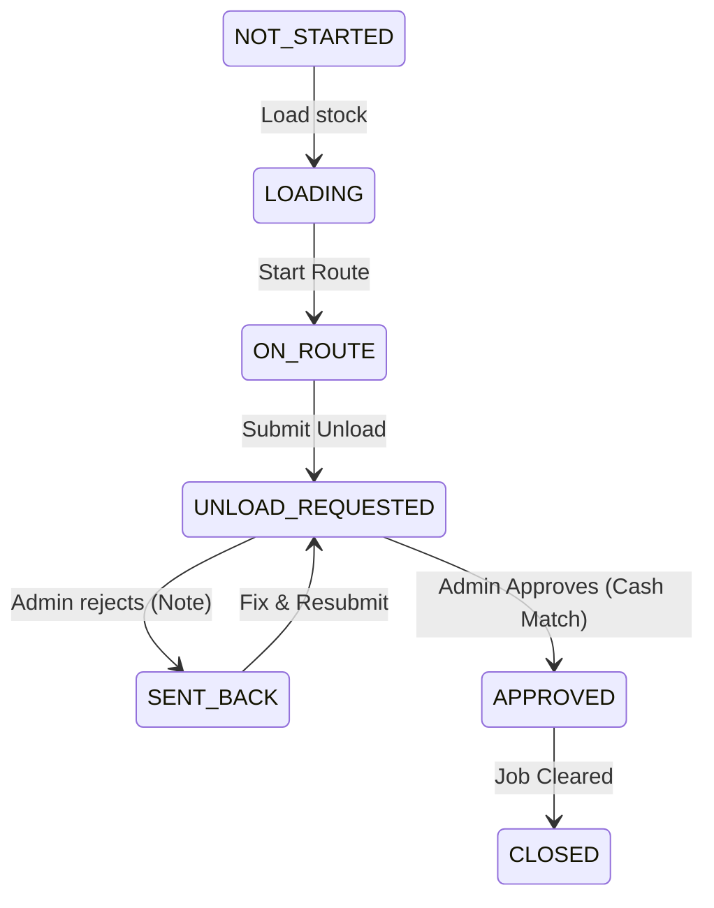

# Salesman Dashboard

A complete, working, mobile-first Salesman Dashboard for an FMCG Van Sales system.

## How to Run

1. `npm install`
2. `npm run dev`
3. Open http://localhost:5173 on your browser (use a mobile viewport like Chrome DevTools -> Device Toolbar -> iPhone 12/13/14).

**To Run Tests:**
```bash
npm run test
```

## Folder Map

```text
src/
├── components/   # Shared UI components
├── data/         # IndexedDB wrappers, offline queue mock, seed data, and mock API
├── domain/       # Core business rules (NO React): units, stockLedger, dayState, money, invoice
├── features/     # React pages (Home, LoadStock, RouteList, SaleEntry, InvoicePrint, Unload, AdminSim, etc.)
├── App.tsx       # Routing and App Shell (Bottom Navigation)
└── main.tsx      # React Entry
```

## Day Lifecycle

The heart of the app is a state machine defined in `src/domain/dayState.ts`.



## Direct Sell & Accounting Flow

The app now supports a fully offline Direct Sell flow:
- **Customers**: Supports saved customers (with outstanding balances, credit limits, and recent history) and Walk-in customers.
- **Payment Modes**: CASH, UPI (with reference ID), and CREDIT (for saved customers with balance checks).
- **Atomic Billing**: Saving a bill atomically writes the invoice, deducts vehicle stock, increments accounting totals (CASH/UPI/CREDIT), and updates the customer's outstanding balance. Voiding reverses everything.
- **Cash Verification Rule**: At day-end, the Unload screen compares the expected CASH against the salesman's entered cash. UPI and Credit sales are recorded but bypassed in the exact cash-match rule. The admin approves only if the cash matches exactly.

## Data Structures and Algorithms (DSA)

1. **Map Lookups `O(1)`**: `src/data/seedData.ts` precomputes a `Map<productId, Product>` so finding product details is instantaneous.
2. **Append-only Stock Ledger `O(N)`**: `src/domain/stockLedger.ts`. Instead of storing mutable `remainingStock` which can desync, we store atomic `LOAD_OUT`, `LOAD_IN`, `SALE`, `SALE_CANCEL`, `UNLOAD_OUT`, and `UNLOAD_IN` events. The stock for *both* warehouse and vehicle is calculated on-the-fly.
3. **Accounting Ledger `O(N)`**: `src/domain/accounting.ts`. Daily running totals (Cash, UPI, Credit) are computed from append-only accounting entries (`SALES_CASH`, `REVERSAL_CASH`, etc.).
4. **Atomic DB Transactions**: In `mockApi.ts`, moving stock between locations, or saving a sale with accounting entries, is performed inside a single IndexedDB transaction. If one side fails, everything rolls back.
5. **State Machine Transition Table `O(1)`**: `src/domain/dayState.ts`. A simple object map defines valid transitions, preventing illegal states (e.g., selling after unloading).
6. **Debounced Search with Binary Search Prefix Match `O(log N)`**: In `SaleEntry.tsx` and `CustomerSelect.tsx`, we sort items once, then use Binary Search to instantly find prefix matches when typing, scaling to 5,000+ customers in under 50ms.
7. **LRU Cache for Recent Customers `O(N log N)`**: Sorting customers by `lastSoldTimestamp` to instantly bubble up frequent buyers to the top.
8. **Unique Offline Invoice Numbering**: `VEH-YYYYMMDD-0001` format generated per-vehicle offline using a local transaction counter.
9. **Memoization (React `useMemo`)**: Used heavily to cache cart totals, stock ledgers, and filtered product lists.

## Connecting a Real Backend Later

Currently, the app uses a mock API layer (`src/data/mockApi.ts`) that writes to IndexedDB.

To connect a real Flask/Django backend:
1. Open `src/data/mockApi.ts`.
2. Replace the IndexedDB calls (`db.get`, `db.put`) with `fetch` or `axios` calls to your actual REST API endpoints.
3. Implement an offline-first sync queue: save mutations to IndexedDB when `navigator.onLine` is false, and flush them to the server when it comes back online. The idempotency keys (`id` fields) in `SaleEvent` and `LoadEvent` ensure the server won't duplicate records.

### Hold Stock Overnight & Top-up Suggestions
Salesmen can now choose to **hold** unsold stock in the vehicle overnight rather than unloading it to the warehouse. 

* **The Unload Screen:** During the end-of-day request, the salesman declares how many items are "Counted Remaining" and assigns a portion to "Hold" versus "Unload".
* **Admin Approval:** Modifies the ledger atomically. Unloaded items generate `UNLOAD_OUT` and `UNLOAD_IN` events, returning stock to the warehouse. Held items generate a strictly audit-only `HOLD_CARRY_FORWARD` ledger event that doesn't modify the running balance.
* **Carrying Forward:** The new WorkDay takes an `openingStockSnapshot` based directly on the closing vehicle balance, making the stock immediately available. The `NOT_STARTED -> ON_ROUTE` transition allows direct route start.
* **Top-up Suggestions:** At `LoadStock.tsx`, a Low Stock warning utilizes a 7-day ring buffer median (`historicalStockLevels`) to intelligently calculate how many items are missing. If current stock < 25% of median, it is suggested for top-up.

#### DSA & Complexity
* **Hold Plan UI**: Map-based state management `O(1)` updates for Hold vs Unload differences.
* **Median Suggestion**: The median is computed via a fixed ring buffer (length 7) stored per-product within the WorkDay snapshot. Extracting the median involves sorting up to 7 numbers which is `O(1)`.
* **Low-stock Sorting**: Sorting `P` products by ratio is `O(P log P)`. Since `P` is tiny, there's no need for a Heap structure.
* **Incremental Maps**: Vehicle summaries are computed in `O(N)` for today's logs using a Map. `HOLD_CARRY_FORWARD` entries are intentionally ignored.

### Cash Denomination Counter
The end-of-day workflow now enforces rigorous cash reconciliation via a denomination counter.

* **Cash Breakdown:** Salesmen enter the exact physical notes (Rs 500, 200, 100, 50, 20, 10) and coins (Rs 10, 5, 2, 1) they are depositing.
* **Auto-Calculations:** The "Actual Cash Collected" is strictly computed from this breakdown in O(1) time and compared against "Expected CASH" (derived from the ledger).
* **Validation & Safety:** The breakdown drafts are debounced and saved in `IndexedDB`, surviving accidental reloads. Non-numeric counts, negatives, and over 9999 are actively prevented. Submitting is blocked entirely unless the breakdown is populated and totals >= 0.
* **Admin Verification:** The `AdminSim` displays the finalized breakdown in a table, asserting that the counts accurately sum to the declared total. Only exact MATCHES can be approved.
* **History:** Approved breakdowns are frozen on the `WorkDay` payload and displayed in the `Summary` view natively.

### Summary > History (Fix & Extension)

**The Root Cause of Missing Past Days**
The bug causing the History view to only display the current day occurred because the queries for invoices and ledger records were hard-coded to filter by the *active* `workDayId` only (`invoices.filter(i => i.workDayId === activeDay.workDayId)`). This effectively erased all past, closed workdays from the view. Additionally, DaySummary snapshots were treated as the single point of truth instead of being a cache. 

**Invoices as the Source of Truth**
In the new architecture, every single invoice guarantees data integrity by embedding its own `calendarDate` (generated at creation in local timezone), `workDayId`, and `status`. Instead of relying purely on DaySummaries, the system computes metrics directly off historical invoices. This means DaySummaries are now just a fast cache.

**Rebuild History (`rebuildHistory`)**
Because DaySummaries are now a cache, an idempotent `rebuildHistory()` function was introduced. It sweeps through all invoices in IndexedDB grouped by `workDayId`, re-calculates the absolute totals (total sales, CASH, UPI, CREDIT splits, number of bills, items sold), and aligns the cached WorkDay records. This function executes automatically on app boot and is available in the DEV Data Health panel, ensuring past days can never permanently drift or disappear.

**The Filter Ecosystem & Views**
We extended the History page with three distinct segmented views:
1. **Day-wise**: Groups the calendar days by month with high-level summaries. Expanding a day reveals the immutable Day Details and cash breakdowns.
2. **Customer-wise**: A specialized view that pivots all valid invoices by customer across the date range, highlighting total spends and outstanding balances.
3. **Invoices**: A flat chronology of every bill across the filtered span.

**Data Structures & Algorithms (DSA) Used**
* **IndexedDB Indexes (`IDBKeyRange`)**: By deploying a `by-calendarDate` index, we query only the localized slice of invoices necessary for the selected date range instead of iterating thousands of bills memory.
* **In-Memory Inverted Indexing**: Inside the Customer and Day-wise views, we build a `Map<customerId, data>` or `Map<calendarDate, data>` once sequentially (`O(N)`), tracking aggregates mathematically in-place instead of constantly re-scanning Arrays (`O(N*M)`).
* **Early Filtering Strategy**: Complex filters (like `billStatus` and `customerId`) are layered iteratively on the initial dataset from IndexedDB. Sorting and Month grouping occurs *after* pruning, preventing heavy DOM/React cycles on non-qualifying data.

### Day Stock Report
The **Day Stock Report** is the single source of truth for all stock movements within a work day, providing the admin with a complete picture of stock in the vehicle.

#### Single Source of Truth
The report is computed dynamically for active days using a single pass (`O(L)`) over all ledger and invoice records for that day via `getDayStockReport()`. When a day is `CLOSED`, the computed report is frozen into `dayStockReportSnapshot` inside the WorkDay object, ensuring historical records never change even if external logic shifts. 

#### Columns & Formulas
The report computes product inventory in exact natural integer pieces using the following formulas:
- **Opening**: Held stock carried forward from the previous day (`HOLD_CARRY_FORWARD` ledger entry).
- **Load Start**: Stock loaded into the vehicle (`LOAD_IN`) while the day state was `LOADING` (before route start).
- **Top-up**: Stock loaded (`LOAD_IN`) while the state was `ON_ROUTE`.
- **Total Available**: `Opening + Load Start + Top-up`.
- **Sold**: Net units sold derived directly from all `SALE` and `SALE_CANCEL` ledger entries.
- **Expected Remaining**: `Total Available - Sold`.
- **Counted Remaining**: Derived from the salesman's requested unload and hold totals (`UNLOAD_OUT` and `workDay.heldItems`).
- **Difference**: `Counted Remaining - Expected Remaining`. 0 is green, negative is red (shortage), positive is amber (excess).
- **Sales Rs**: Derived from all `VALID` invoices (`lineTotalPaise`). Does not include cancelled (`VOID`) bills.

#### Legacy Data Migration
For older load records that were created before the "Top-up" phase feature existed, the system automatically runs a database upgrade (`v6`). It assigns `phase = 'TOPUP'` to any load record whose timestamp occurred after the `routeStartedAt` time of the work day, and defaults to `START` otherwise.

### Stock Summary Table & Pricing Snapshots
The admin panel and day details views now use the heavily optimized `StockSummaryTable` layout to display the entire narrative of a day's stock exactly as field supervisors expect.

**Features & Layout:**
- **Compact Table Structure:** Replaces disparate cards with a single unified table.
- **Table Columns:** 
  - `ITEM`: Product name.
  - `TOTAL STOCK AT START`: Opening held + Loaded. Shows Pieces and Start Amount (Rs).
  - `SOLD`: Total Pieces sold and Sold Amount (Rs) from VALID invoices only.
  - `REMAINING`: Split into `To Godown` (returning) and `Stay Vehicle` (holding).
- **Amount Rules:** All amounts are strictly tied to a `priceSnapshotPaise` taken exactly when the day was opened. Start Amount = `Start Pieces * Snapshot Price`. Sold Amount = `Sum of VALID invoice lines`. Remaining Amount = `Remaining Pieces * Snapshot Price`.
- **Integrity Validation:** Visually highlights rows where `Total at start != Sold + Remaining`. Shortages are marked red, excesses are marked amber. 
- **Reusability:** This exact table is mounted in the Admin Simulator, the Salesman's History > Day Detail, and the Print layouts (A4 & 80mm).

**Price Snapshots:**
To ensure closed days never mathematically drift when product prices change in the future, `mockApi.ts` now embeds a `pricesSnapshot` directly into the `WorkDay` on creation. `rebuildHistory.ts` leverages this to backfill snapshots for older closed days.

## Stock Summary Table (Admin & Print Detail View)
The `StockSummaryTable` provides a clear, unified view of the stock flow for each product:
- **Columns**: 
  - **ITEM**: Product name
  - **TOTAL STOCK AT START**: Start pieces (carried + loaded) and amount.
  - **SOLD**: Pieces sold and sales amount (only VALID invoices).
  - **REMAINING**: Pieces returning to godown and held in vehicle, and total amount.
- **Amounts**: Money is stored internally in integer paise and pieces, converted only for display. 
- **Price Snapshot**: The `WorkDay` stores a `pricesSnapshot` at the start of the day. All amounts are calculated against this snapshot to ensure historical records never change if prices are updated later.
- **Reusability**: This shared component is used in:
  - Admin Approval Dashboard Detail View
  - Salesman Summary > History > Day Detail
  - Print Day Report (A4 and 80mm layouts)
# inventry_managment
